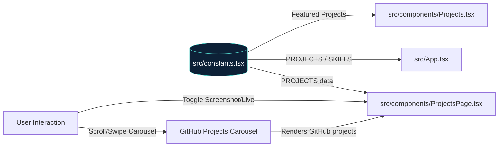

# Data Flow Diagram

> Generated by Graphify on 2026-06-08. Last updated: 2026-06-08.

## Diagram

## Analysis Notes

- **Data Source:** Static configurations stored in `src/constants.tsx` as the single source of truth.
- **Data Mutation:** There is no server-side persistence in this SPA; UI state transitions are managed client-side using React's `useState`.
