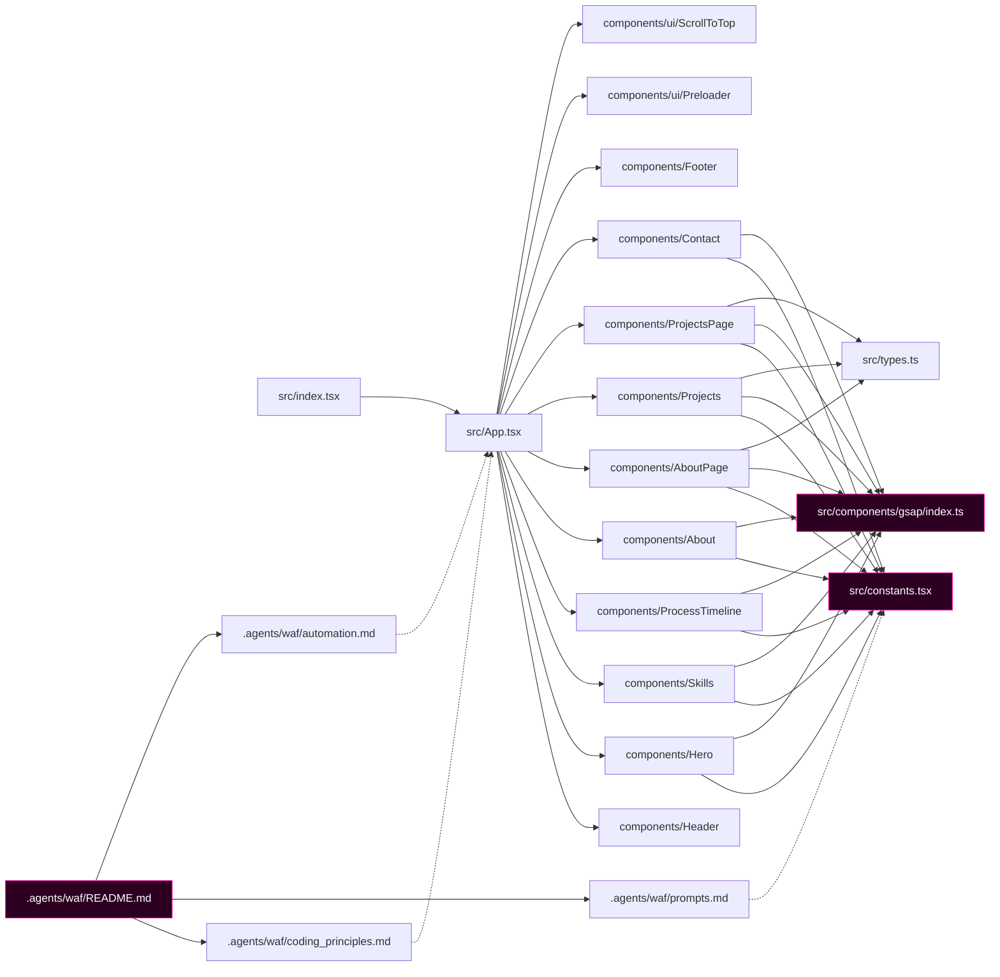

# Component Dependency Graph

> Generated by Graphify on 2026-06-08. Last updated: 2026-06-08.

## Diagram

## Analysis Notes

- **Circular dependencies:** None identified.
- **Hub nodes:** `src/constants.tsx` and `src/components/gsap/index.ts` are primary hubs imported by multiple components.
- **Orphans:** None identified.
