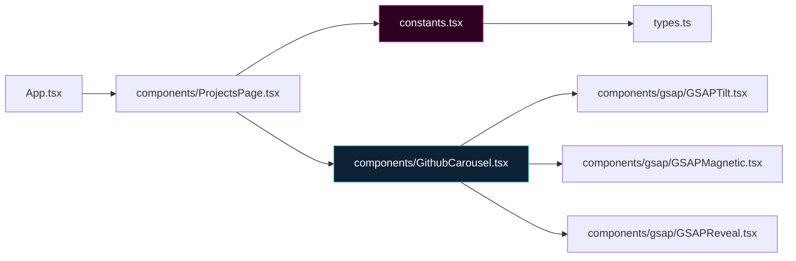

# Component Dependency Graph

> Generated by Graphify on 2026-06-08. Last updated: 2026-06-08.

## Diagram

## Analysis Notes

- **Circular dependencies:** None.
- **Hub nodes:** `constants.tsx` remains the single source of truth for portfolio profile, timeline, skills, and projects data.
- **New component:** `GithubCarousel.tsx` isolates the GitHub projects slider to avoid cluttering `ProjectsPage.tsx`.
