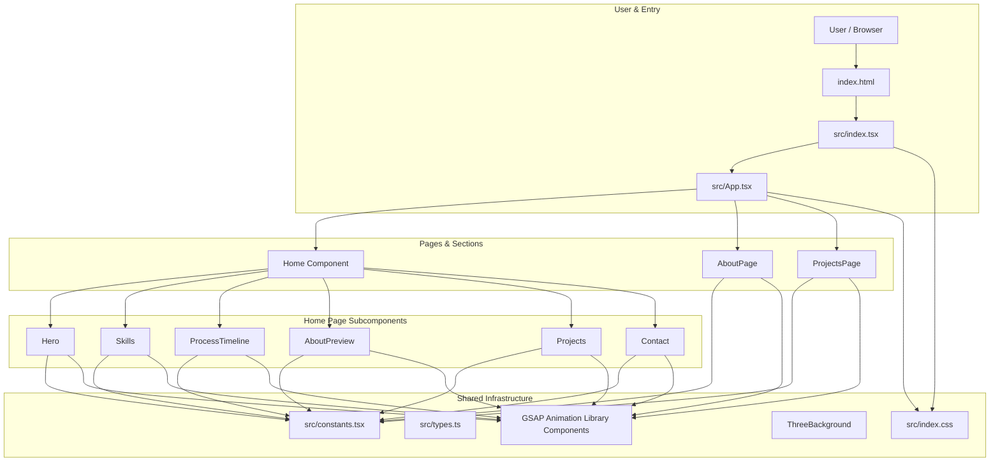

# System Topology

> Generated by Graphify on 2026-06-08. Last updated: 2026-06-08.

## Diagram

## Analysis Notes

- **Critical paths:** The routing path from `src/index.tsx` -> `src/App.tsx` which renders the active page.
- **Risk areas:** Proper resource loading and routing setup when moving files under `src/`.
