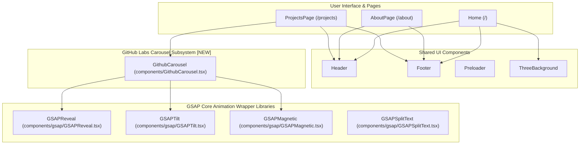

# System Topology

> Generated by Graphify on 2026-06-08. Last updated: 2026-06-08.

## Diagram

## Analysis Notes

- **Critical paths:** The new `GithubCarousel` is embedded inside `ProjectsPage.tsx` at the bottom, which is snap-scrolled. It leverages `GSAPTilt`, `GSAPMagnetic`, and `GSAPReveal` for modern neobrutalist interactions.
- **Risk areas:** Lenis scrolling and CSS snap scroll could conflict if horizontal scrolling pins the view using GSAP ScrollTrigger. By utilizing an interactive draggable/clickable strip, we eliminate snap scroll conflicts.
